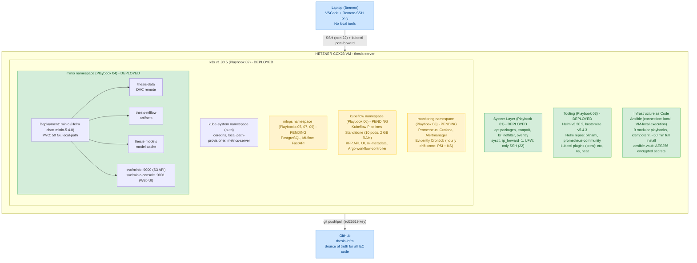
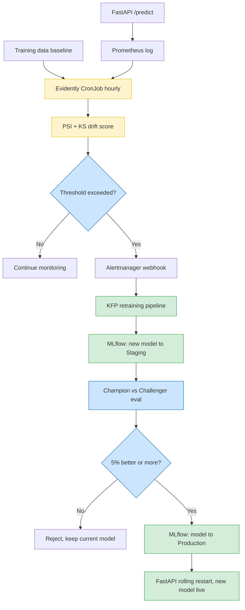

# thesis-infra

> Infrastructure-as-Code (Ansible + k3s + Kubeflow Pipelines Standalone) for a self-updating predictive maintenance MLOps platform — Master's thesis artifact.

## Project Goal

This repository contains the full infrastructure provisioning code for a **closed-loop MLOps system** that predicts the Remaining Useful Life (RUL) of turbofan engines from sensor data and **auto-recovers** when the production data distribution drifts away from the training distribution.

The thesis differentiates itself from the typical "train an LSTM on C-MAPSS, report RMSE" project by focusing on what happens **after** the model is deployed:

- continuous monitoring of input distribution and prediction quality,
- automated drift detection (PSI, KS-test) via Evidently AI,
- automatic retraining pipelines triggered when drift exceeds a threshold,
- champion-challenger evaluation before promoting a new model to production,
- end-to-end measurement of **drift-to-recovery latency**.

All components are 100% open source and run on a single Hetzner VM, making the stack reproducible inside any on-prem or air-gapped data center — relevant for defense-sector deployments where cloud is not an option.

**Dataset:** NASA C-MAPSS turbofan degradation dataset (open-access proxy for classified military engine telemetry).

**Deployment target:** Hetzner Cloud CCX23 (4 dedicated vCPU, 16 GB RAM, 160 GB NVMe SSD, Ubuntu 22.04 LTS, Falkenstein, Germany).

**Provisioning time:** ~50 minutes from a blank VM to a fully running MLOps stack via `ansible-playbook site.yml`.

---

## Architecture



### Architecture Explanation

1. **Hetzner CCX23 VM**: Single-node deployment target — the entire MLOps stack runs here. Chosen for cost (~€30/month), GDPR compliance, and on-prem parity with defense-sector data centers.

2. **k3s**: Lightweight CNCF-certified Kubernetes distribution. Single binary, sub-second startup, full API compatibility. Traefik and servicelb are disabled — we use `kubectl port-forward` instead of an ingress controller.

3. **minio namespace**: S3-compatible object storage. Hosts three buckets that back DVC (data versioning), MLflow (experiment artifacts), and the FastAPI model cache. All MLOps state lives here.

4. **mlops namespace**: The core thesis layer. PostgreSQL stores metadata; MLflow tracks every training run and serves as the Model Registry; FastAPI loads the current Production-stage model and exposes a `/predict` REST endpoint.

5. **kubeflow namespace**: Kubeflow Pipelines Standalone — pipeline orchestration only. Notebooks, Katib, KServe, Dex, Istio are deliberately omitted; they would consume ~4 GB extra RAM and add no thesis value. Replaced by VSCode Remote-SSH (notebooks), Optuna (HP search), and FastAPI (serving).

6. **monitoring namespace**: Prometheus scrapes pod metrics; Grafana visualizes them; Alertmanager fires webhooks on drift threshold breach. Evidently AI runs hourly as a Kubernetes CronJob, computing PSI and KS-test drift scores between the training and production data distributions — this is the trigger for the closed-loop retraining cycle.

7. **Ansible**: Provisioning runs on the VM itself (`connection: local`). No tooling on the laptop. Each playbook is idempotent and component-scoped, so a failure can be debugged in isolation. Secrets are stored encrypted via `ansible-vault`.

8. **Laptop**: Used only for SSH-based development through VSCode Remote-SSH and for opening port-forwarded UIs in a browser. No Docker, Python, kubectl, or Ansible is installed locally.

9. **GitHub**: Public source of truth. The encrypted vault file is committed — the AES256 ciphertext is safe to publish; only someone with the vault password can decrypt it.

---

## Closed-Loop Retraining (Thesis Core Contribution)



**Measured metric:** `drift-to-recovery latency` — wall-clock time from drift detection to the new model serving traffic.

---

## Repository Layout

```
thesis-infra/
├── ansible.cfg                 # Ansible global config
├── requirements.yml            # Galaxy collections
├── README.md                   # This file
│
├── inventory/
│   ├── localhost.yml           # connection: local
│   └── group_vars/
│       ├── all.yml             # shared variables
│       └── vault.yml           # AES256-encrypted secrets
│
├── playbooks/
│   ├── 01-system-prep.yml      # kernel, swap, sysctl, firewall  [done]
│   ├── 02-k3s.yml              # Kubernetes                       [done]
│   ├── 03-helm-tools.yml       # Helm, kustomize, krew            [done]
│   ├── 04-minio.yml            # S3-compatible object storage     [done]
│   ├── 05-postgres.yml         # MLflow / KFP metadata DB         [pending]
│   ├── 06-kfp-standalone.yml   # Kubeflow Pipelines               [pending]
│   ├── 07-mlflow.yml           # Experiment tracking + Registry   [pending]
│   ├── 08-monitoring.yml       # Prometheus + Grafana + Evidently [pending]
│   └── 09-fastapi.yml          # Inference REST endpoint          [pending]
│
├── files/                      # Static configs (Helm values, manifests)
└── scripts/                    # Helper bash scripts (port-forward, healthcheck)
```

## License

MIT — see `LICENSE`. This work is part of an academic Master's thesis.
