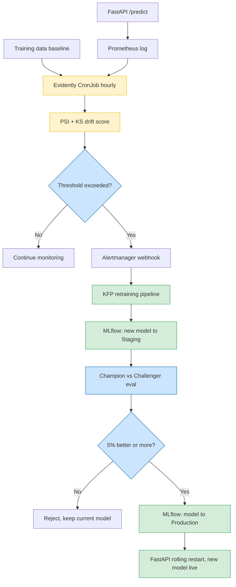

# thesis-infra

> Infrastructure-as-Code (Ansible + k3s + Kubeflow Pipelines Standalone) for a self-updating predictive maintenance MLOps platform — Master's thesis artifact.

## Project Goal

This repository contains the full infrastructure provisioning code for a **closed-loop MLOps system** that predicts the Remaining Useful Life (RUL) of turbofan engines from sensor data and **auto-recovers** when the production data distribution drifts away from the training distribution.

The thesis differentiates itself from the typical "train an LSTM on C-MAPSS, report RMSE" project by focusing on what happens **after** the model is deployed:

- continuous monitoring of input distribution and prediction quality,
- automated drift detection (PSI, KS-test) via Evidently AI,
- automatic retraining pipelines triggered when drift exceeds a threshold,
- champion-challenger evaluation before promoting a new model to production,
- end-to-end measurement of **drift-to-recovery latency**.

All components are 100% open source and run on a single Hetzner VM, making the stack reproducible inside any on-prem or air-gapped data center — relevant for defense-sector deployments where cloud is not an option.

**Dataset:** NASA C-MAPSS turbofan degradation dataset (open-access proxy for classified military engine telemetry). Data is versioned via DVC and stored in MinIO; the GitHub repository contains only the metadata pointer (`*.dvc` file).

**Deployment target:** Hetzner Cloud CCX23 (4 dedicated vCPU · 16 GB RAM · 160 GB NVMe SSD · Ubuntu 22.04 LTS · Falkenstein, Germany).

**Provisioning time:** A blank VM reaches a fully running MLOps stack via `ansible-playbook site.yml` in approximately 50 minutes, plus a `dvc pull` to restore the dataset from MinIO.

---

## Architecture

```mermaid
flowchart TB
    subgraph VM["HETZNER CCX23 VM — thesis-server (Falkenstein)<br/>Ubuntu 22.04 · 4 vCPU · 16 GB RAM · 160 GB NVMe"]
        direction TB

        subgraph SYS["System Layer (Playbook 01) — DEPLOYED"]
            S1["apt packages · swap=0 · br_netfilter · overlay<br/>sysctl: ip_forward=1 · UFW: only SSH (22)"]
        end

        subgraph K3S["k3s v1.30.5+k3s1 (Playbook 02) — Node: mlops-master"]
            direction TB

            subgraph KS["kube-system namespace (auto)"]
                CD["coredns<br/>(cluster DNS)"]
                LP["local-path-provisioner<br/>(StorageClass)"]
                MS["metrics-server"]
            end

            subgraph MINIO["minio namespace (Playbook 04) — DEPLOYED"]
                MIO["Deployment: minio (Helm chart minio-5.4.0)<br/>PVC: 50 Gi · local-path"]
                B1["thesis-data<br/>(DVC remote — C-MAPSS)"]
                B2["thesis-mlflow<br/>(artifacts)"]
                B3["thesis-models<br/>(model cache)"]
                SVC1["svc/minio :9000 (S3 API)<br/>svc/minio-console :9001 (Web UI)"]
                MIO --> B1 & B2 & B3
                MIO --> SVC1
            end

            subgraph MLOPS["mlops namespace (Playbooks 05, 07) — PARTIAL"]
                PG["PostgreSQL — DEPLOYED<br/>postgres-0 · 10 Gi PVC<br/>databases: mlflow, kfp"]
                MLF["MLflow — DEPLOYED<br/>tracking + Model Registry<br/>backend: postgres · artifacts: minio"]
                FA["FastAPI — PENDING (Playbook 09)<br/>REST inference endpoint /predict"]
            end

            subgraph KF["kubeflow namespace (Playbook 06) — DEPLOYED"]
                KFP["Kubeflow Pipelines Standalone (14 pods)<br/>KFP API · UI · ml-metadata · Argo<br/>workflow-controller · persistence-agent<br/>bundled MySQL + seaweedfs (internal cache)<br/>NOT installed: Istio, Dex, KServe, Katib, Notebooks"]
            end

            subgraph MON["monitoring namespace (Playbook 08) — DEPLOYED"]
                PROM["Prometheus (kube-prometheus-stack 85.0.3)<br/>10 Gi PVC · 5d retention · 13 UP targets<br/>scrapes all namespaces"]
                GRAF["Grafana<br/>5 Gi PVC · 25+ pre-built dashboards<br/>admin password from vault"]
                AM["Alertmanager<br/>2 Gi PVC · webhook receiver<br/>(will trigger KFP retraining on drift)"]
                EVI["Evidently CronJob — PENDING<br/>(hourly drift score: PSI + KS)"]
            end
        end

        subgraph DEV["Dev environment (Playbook 10) — DEPLOYED"]
            VENV["Python 3.12 venv at /root/thesis-infra/.venv<br/>DVC 3.67 · MLflow 2.18 · PyTorch CPU · Evidently · Optuna"]
            DVC["DVC tracking<br/>data/raw/cmapss/ → 13 .txt files (gitignored)<br/>data/raw/cmapss.dvc → 300-byte metadata (in Git)<br/>Remote: s3://thesis-data/dvc/ (MinIO)<br/>15 objects pushed"]
        end

        subgraph TOOLS["Tooling (Playbook 03) — DEPLOYED"]
            T1["Helm v3.20.2 · kustomize v5.4.3<br/>Helm repos: bitnami · prometheus-community · community · minio<br/>kubectl plugins (krew): ctx · ns · neat"]
        end

        subgraph IAC["Infrastructure as Code"]
            I1["Ansible (connection: local · VM-local execution)<br/>9 modular playbooks · idempotent · ~50 min full install<br/>ansible-vault: AES256 (MinIO / Postgres / Grafana pwds)"]
        end
    end

    LAPTOP["Laptop (Bremen)<br/>VSCode + Remote-SSH only<br/>No local tools"]
    GH["GitHub<br/>thesis-infra<br/>Source of truth for all IaC code"]

    LAPTOP -- "SSH (port 22) +<br/>kubectl port-forward" --> VM
    VM -- "git push/pull<br/>(ed25519 key)" --> GH

    classDef done fill:#d4edda,stroke:#28a745,color:#155724
    classDef partial fill:#fff3cd,stroke:#ffc107,color:#856404
    classDef external fill:#cce5ff,stroke:#0066cc,color:#004085

    class SYS,MINIO,KF,MON,TOOLS,IAC,DEV done
    class MLOPS partial
    class LAPTOP,GH external
```



### Architecture Explanation

1. **Hetzner CCX23 VM**: Single-node deployment target — the entire MLOps stack runs here. Chosen for cost (~€30/month), GDPR compliance, and on-prem parity with defense-sector data centers.

2. **k3s**: Lightweight CNCF-certified Kubernetes distribution. Single binary, sub-second startup, full API compatibility. Traefik and servicelb are disabled — we use `kubectl port-forward` instead of an ingress controller.

3. **minio namespace**: S3-compatible object storage. Hosts three buckets that back DVC (data versioning), MLflow (experiment artifacts), and the FastAPI model cache. All MLOps state lives here.

4. **mlops namespace**: The core thesis layer. PostgreSQL stores metadata; MLflow tracks every training run and serves as the Model Registry; FastAPI (pending Playbook 09) loads the current Production-stage model and exposes a `/predict` REST endpoint.

5. **kubeflow namespace**: Kubeflow Pipelines Standalone — pipeline orchestration only. Notebooks, Katib, KServe, Dex, Istio are deliberately omitted; they would consume ~4 GB extra RAM and add no thesis value. Replaced by VSCode Remote-SSH (notebooks), Optuna (HP search), and FastAPI (serving).

6. **monitoring namespace**: Prometheus scrapes pod metrics across all namespaces (currently 13 UP scrape targets); Grafana visualizes them through 25+ pre-built Kubernetes dashboards. Alertmanager fires webhooks on threshold breach — once the Evidently CronJob is added, this becomes the trigger for the closed-loop retraining cycle.

7. **Dev environment & DVC**: A Python 3.12 virtual environment with DVC, MLflow, PyTorch (CPU), Evidently, and Optuna. The C-MAPSS dataset is versioned by DVC — the 13 `.txt` files (~17 MB) live in MinIO bucket `thesis-data/dvc/`, while only a 300-byte metadata pointer (`cmapss.dvc`) is committed to Git. Reproducing the exact dataset used by any commit is a two-step recipe: `git checkout <hash>` then `dvc pull`.

8. **Ansible**: Provisioning runs on the VM itself (`connection: local`). No tooling on the laptop. Each playbook is idempotent and component-scoped, so a failure can be debugged in isolation. Secrets are stored encrypted via `ansible-vault`.

9. **Laptop**: Used only for SSH-based development through VSCode Remote-SSH and for opening port-forwarded UIs in a browser. No Docker, Python, kubectl, or Ansible is installed locally.

10. **GitHub**: Public source of truth. The encrypted vault file is committed — the AES256 ciphertext is safe to publish; only someone with the vault password can decrypt it. Raw data is excluded from Git (versioned by DVC instead).

---

## Closed-Loop Retraining (Thesis Core Contribution)



**Measured metric:** `drift-to-recovery latency` — wall-clock time from drift detection to the new model serving traffic.

---

## Repository Layout

```
thesis-infra/
├── ansible.cfg                 # Ansible global config
├── requirements.yml            # Galaxy collections
├── README.md                   # This file
├── LICENSE                     # MIT
│
├── inventory/
│   ├── localhost.yml           # connection: local
│   └── group_vars/
│       ├── all.yml             # shared variables
│       └── vault.yml           # AES256-encrypted secrets
│
├── playbooks/
│   ├── 01-system-prep.yml      # kernel, swap, sysctl, firewall    [done]
│   ├── 02-k3s.yml              # Kubernetes                         [done]
│   ├── 03-helm-tools.yml       # Helm, kustomize, krew              [done]
│   ├── 04-minio.yml            # S3-compatible object storage       [done]
│   ├── 05-postgres.yml         # MLflow / KFP metadata DB           [done]
│   ├── 06-kfp-standalone.yml   # Kubeflow Pipelines                 [done]
│   ├── 07-mlflow.yml           # Experiment tracking + Registry     [done]
│   ├── 08-monitoring.yml       # Prometheus + Grafana + Alertmanager [done]
│   ├── 09-fastapi.yml          # Inference REST endpoint            [pending]
│   └── 10-data-and-dev-env.yml # Python venv + C-MAPSS + DVC        [done]
│
├── files/                      # Static configs (Helm values, init SQL, etc.)
│   ├── postgres/               # PostgreSQL init SQL
│   ├── monitoring/             # kube-prometheus-stack values.yaml
│   └── data/                   # requirements.txt (Python deps)
│
├── data/                       # Project data (mostly gitignored)
│   ├── raw/
│   │   ├── cmapss/             # 13 C-MAPSS .txt files (gitignored, DVC tracked)
│   │   └── cmapss.dvc          # DVC metadata pointer (300 bytes, in Git)
│   └── processed/              # Output of preprocessing (gitignored)
│
├── .dvc/                       # DVC configuration
│   ├── config                  # MinIO remote definition
│   └── .gitignore              # Cache exclusion (auto-generated)
├── .dvcignore                  # DVC scan exclusion list
│
├── scripts/                    # Helper bash scripts
│   ├── healthcheck.sh          # Fast cluster health snapshot
│   └── port-forward-all.sh     # Open all UIs to laptop
│
├── tests/                      # Hierarchical test suite
│   ├── README.md               # Testing strategy + design principles
│   ├── _lib.sh                 # Common helpers (pass/fail/skip + assertions)
│   ├── run-all.sh              # Orchestrator
│   ├── 01-infra/               # Pod/PVC/node-level tests
│   ├── 02-connectivity/        # DNS + cross-pod reachability
│   ├── 03-functional/          # MinIO/Postgres/MLflow/KFP/Prometheus/
│   │                           # Grafana/Alertmanager/DVC R/W and API
│   └── 99-integration/         # End-to-end scenarios (planned)
│
└── docs/                       # Operational documentation
    └── FIRST_LOOK.md           # Quick-reference for daily use
```

## License

MIT — see `LICENSE`. This work is part of an academic Master's thesis.
